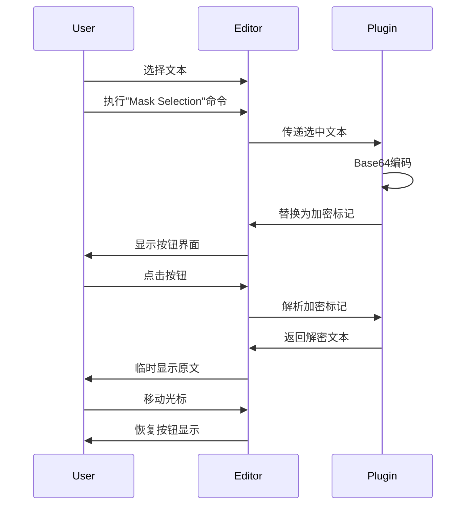

# Mask-Smith VSCode插件需求说明书

## 1. 项目概述

Mask-Smith是一个VSCode插件，用于保护文本文件中的敏感信息。它通过将选中的敏感文本进行Base64编码和特殊标记，在编辑器中以按钮形式显示，实现敏感信息的即时隐藏和查看功能。

## 2. 功能需求

### 2.1 文本加密功能

- **选择文本加密**
  - 用户可以选择任意文本片段
  - 通过命令面板执行"Mask Selection"命令
  - 系统将选中文本使用UTF-8编码后进行Base64转换
  - 转换后的文本将被包装为特定格式：`<!MASK-SMITH:xxx/>`（其中xxx为Base64编码后的文本）

### 2.2 用户界面

- **加密文本显示**
  - 加密后的文本在编辑器中显示为按钮形式
  - 按钮文本显示为"点击查看"
  - 按钮样式应与编辑器主题协调

- **解密文本显示**
  - 点击按钮后显示原始文本
  - 原始文本应与普通文本区分（使用特殊样式或背景色）
  - 当光标移出时自动恢复为按钮显示

### 2.3 交互流程

## 3. 技术需求

### 3.1 编码要求
- 使用UTF-8字符集进行文本处理
- 使用标准Base64算法进行编码

### 3.2 文件处理
- 支持所有文本类型文件
- 在原文件上直接进行修改
- 保持文件的其他格式不变

### 3.3 编辑器集成
- 实现VSCode命令注册
- 实现自定义按钮渲染
- 实现文本装饰器（Decorator）
- 处理鼠标事件和光标事件

## 4. 非功能性需求

### 4.1 性能要求
- 加密/解密操作响应时间不超过100ms
- 内存占用不超过50MB

### 4.2 兼容性要求
- 支持VSCode 1.60.0及以上版本
- 支持Windows/MacOS/Linux平台
- 支持多语言编码

### 4.3 安全性要求
- 加密数据仅在本地处理
- 不进行任何网络传输
- 确保临时显示的原文不被保存

### 4.4 用户体验要求
- 提供清晰的命令提示
- 加密/解密状态明确
- 操作步骤简单直观
- 支持快捷键操作

## 5. 后续优化方向

- 支持自定义加密算法
- 提供批量处理功能
- 添加加密历史记录
- 支持导出加密文本报告
- 提供更多自定义显示选项